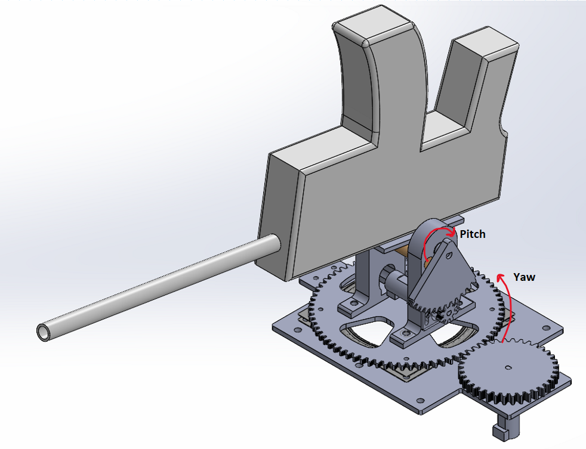
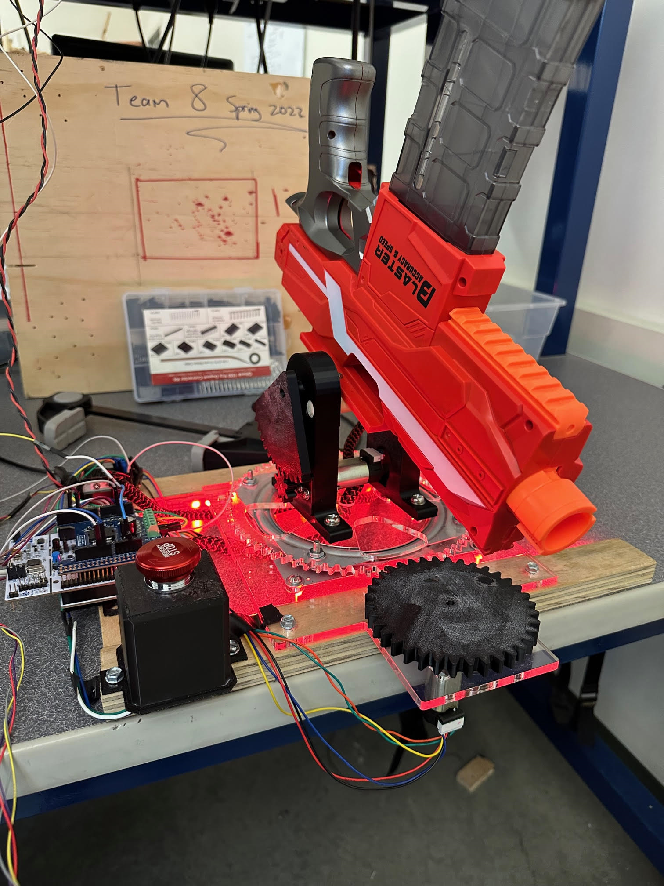
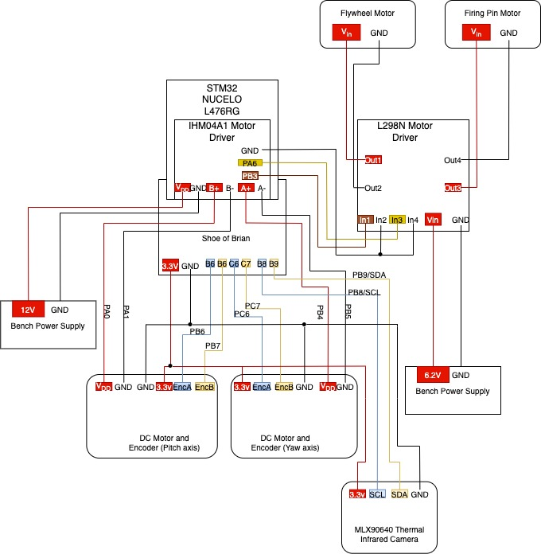

# ME405 Term Project 
## ME 405 
#### **Authors: Tristan Cavarno, Miloh Padgett, Jon Abraham**

The following documentation describes our design for the ME405 Term Project: Learn by Dueling. The objective of this project was to create 
a system that autonomously aims and fires a foam dart gun at a target from an opposing team. Infrared (IR) cameras and DC Motors were provided 
by the lab instructor. The rest of the system was purchased and/or manufactured.

## Hardware Design
Per the project guidelines, the dart gun was required to face 180&deg; away from the opponent in its starting position. Two axes of motion were needed,
so a yaw axis (for horizontal motion) and pitching axis (vertical positioning of the gun) were chosen. From a previous assignment and preliminary
testing, it was determined that gearing ratios of 1:2 and 1:6 respectively would provide adequate torque to move the approximate mass of the gun and 
pitching carriage assembly. These ratios are directly proportional to the encoder ticks required for an angular setpoint, so increasing the ratio
provides greater precision at slower speeds. Spur gears mounted with press fits on the D-slotted motor shafts were chosen due to ease of iteration with 3D printing, and slots 
were included in each motor mount to provide adjustable mating surfaces. The pitching axis rested on two PLA hinges with a machined aluminum drive shaft and 8mm flanged ball
bearings. These hinges were then bolted on top of a geared lazy susan bearing to enable the yaw motion. See Figures 1 and 2 below for labeled diagrams with the two axes of 
motion and a picture of the fully assembled system. 

**Figure 1.** Isometric SolidWorks Assembly view with the two axes of motion labeled. 

**Figure 2.** Photo of assembled system during testing. 

The code in this repository was writted to interface with two Ametek/Pittman PG6712A077-R3 6665 motors. The dart gun that we selected was a Snowcinda Automatic Machine Gun Toy Gun
purchased from Amazon. 

## Circuit Schematics 

**Figure 3.** Wiring diagram of all of the connections to the STM32 and various motors and motor controllers necesaary for controlling the gun. 

## Software Design

## Future Recommendations

Here is a list of some lessons that we have learned while working on this project and recommendations for work on similar systems in the future:
- Properly tensioned timing belts reduce backlash and would allow for more accurate and reliable positional control.
- A more universal hinge design (i.e. mounting the bearings on a block of wood or thinner triangular mounts) allows for faster iteration/saving material.
- Make a separate control box assembly to simplify the construction of the gun base and reduce clearance issues 
